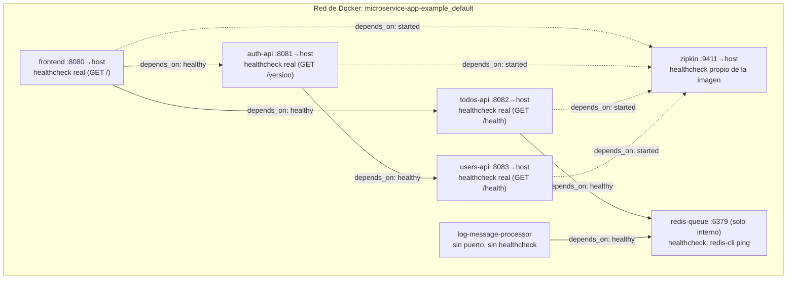

# docker-compose.yml — Documentación técnica

## 1. Alcance

`docker-compose.yml` orquesta los cinco servicios de la aplicación (`frontend`, `auth-api`, `todos-api`, `users-api`, `log-message-processor`), la cola de eventos (`redis-queue`) y el componente de trazado distribuido (`zipkin`).

## 2. Diagrama de arquitectura de contenedores

El diagrama de `/arch-img/Microservices.png` es la arquitectura *lógica* de la app (qué servicio le habla a cuál). Este otro es la vista de *despliegue*: contenedores, red de Docker, qué puerto queda publicado al host, y qué tan real es el `HEALTHCHECK` de cada uno (ver `docs/DOCKER.md` sección 3 para el detalle del patrón Health Endpoint Monitoring). Las flechas son las relaciones `depends_on` de `docker-compose.yml`, es decir, el orden real en el que Compose arranca los contenedores.



`frontend` es el último en poder arrancar: depende (transitivamente) de que `auth-api`, `todos-api`, `users-api` y `redis-queue` ya estén sanos. `log-message-processor` solo depende de `redis-queue`, es el único que no expone HTTP.

## 3. Componentes del archivo

### `depends_on` con `condition:` (forma larga)

La forma simple de `depends_on` (una lista de nombres de servicio) únicamente garantiza el orden de arranque de los contenedores, sin esperar a que el servicio dependido esté realmente listo para recibir peticiones. Dado que cada servicio de la aplicación define un `HEALTHCHECK` en su Dockerfile, el compose usa la forma larga:

```yaml
depends_on:
  users-api:
    condition: service_healthy
```

Con `condition: service_healthy`, Docker no arranca el servicio dependiente hasta que el `HEALTHCHECK` del servicio del que depende reporte "healthy" al menos una vez. Para `zipkin`, que no define `HEALTHCHECK` propio en este archivo, se usa `condition: service_started`, que solo espera a que el contenedor exista y esté en ejecución.

### `image:` junto con `build:`

```yaml
build: ./frontend
image: microservice-app-example/frontend
```

`build:` indica el contexto desde el cual construir la imagen; `image:` le asigna un nombre fijo al resultado. Sin esta segunda línea, Compose genera un nombre automático dependiente de la carpeta desde la que se ejecute el comando. Fijar el nombre explícitamente es relevante para etapas posteriores del proyecto: al publicar estas imágenes en un registry o referenciarlas en manifiestos de Kubernetes, se usa exactamente este nombre.

### `${JWT_SECRET:-myfancysecret}`

La sintaxis `${VAR}` toma el valor de la variable desde el archivo `.env`. El operador `:-` agrega un valor por defecto: si `JWT_SECRET` no está definida en ningún lado, se usa `myfancysecret` en lugar de fallar. Esto permite que el proyecto arranque sin configuración adicional en un primer uso, sin impedir que se sobrescriba con un `.env` propio en cualquier otro entorno.

### `redis-queue` sin `ports:` publicados al host

Ningún proceso fuera de la red de Docker necesita conectarse directamente a Redis; únicamente lo hacen `todos-api` y `log-message-processor`, que lo alcanzan por la red interna de Compose sin necesidad de exponerlo al host. La ausencia de bloque `ports:` en este servicio es intencional, no una omisión. `zipkin`, en cambio, sí publica su puerto (`9411`), ya que su interfaz está pensada para consultarse desde el navegador.

### `log-data`: volumen para el filtro `persist`

El filtro `persist` de `log-message-processor` (ver `docs/DOCKER.md` sección 5) escribe cada mensaje procesado en `/data/processed.log`, dentro del contenedor. Sin un volumen, ese archivo viviría en la capa de escritura del contenedor y se perdería al recrearlo. El volumen con nombre `log-data`, declarado al final de este archivo y montado en `log-message-processor` como `log-data:/data`, hace que el archivo sobreviva a un `docker compose down` seguido de `docker compose up`, mientras el volumen no se borre explícitamente con `docker compose down -v`.

## 4. Zipkin: dos formatos de URL

`log-message-processor` envía trazas a `/api/v1/spans`, mientras que los otros tres servicios instrumentados usan `/api/v2/spans`. Se verificó en el código fuente (`log-message-processor/main.py`) que ese servicio codifica los datos con `Content-Type: application/x-thrift` (formato binario Thrift), que corresponde al endpoint v1 de Zipkin. Los demás servicios usan clientes de Zipkin que codifican en JSON, correspondiente al endpoint v2. Son dos formatos de transporte distintos hacia el mismo Zipkin, cada uno dirigido a la ruta que le corresponde.

## 5. `SPRING_ZIPKIN_BASE_URL`

La propiedad real en `users-api` es `spring.zipkin.baseUrl` (confirmada en `application.properties`). El nombre de variable de entorno que la sobrescribe depende de las reglas de "relaxed binding" de Spring, cuyo comportamiento en el límite exacto entre palabras en camelCase (`base` + `Url`) ha sido inconsistente históricamente entre versiones, particularmente en líneas antiguas de Spring Boot como la 1.5.6 usada en este proyecto. No fue posible confirmar el comportamiento exacto sin ejecutar la aplicación con una JVM disponible.

**Procedimiento de verificación:** con el sistema en ejecución, acceder a `http://localhost:9411`, generar tráfico desde el frontend (login o creación de un todo) y buscar trazas con `serviceName = users-api`. Su presencia confirma que la variable se está leyendo correctamente.

**Alternativa sin ambigüedad**, en caso de que la traza no aparezca: agregar la siguiente variable, que no depende de ninguna conversión de nombre:

```yaml
JAVA_TOOL_OPTIONS: -Dspring.zipkin.baseUrl=http://zipkin:9411
```

`JAVA_TOOL_OPTIONS` es leída automáticamente por la JVM al arrancar (se imprime un aviso informativo "Picked up JAVA_TOOL_OPTIONS" en los logs, sin efecto negativo). El flag `-D` fija el nombre exacto de la propiedad, sin pasar por ningún mecanismo de conversión.

Este punto no afecta el funcionamiento principal de la aplicación: `users-api` opera igual con o sin trazado hacia Zipkin. Se trata de una mejora de observabilidad, no de una dependencia crítica del sistema.

## 6. Verificación del sistema

```bash
docker compose up --build
```

1. **Estado de los contenedores.** En una segunda terminal:

   ```bash
   docker compose ps
   ```

   Transcurridos entre 30 y 40 segundos, la columna de estado debe mostrar `(healthy)` para `auth-api`, `todos-api`, `users-api` y `redis-queue`. Un servicio que permanece en `(unhealthy)` durante un período prolongado es el primer punto a revisar.

2. **Flujo completo de la aplicación.** Acceder a `http://localhost:8080`, iniciar sesión con `admin`/`admin`, crear un todo y eliminarlo.

3. **Pipeline de eventos.**

   ```bash
   docker compose logs -f log-message-processor
   ```

   Debe mostrarse el mensaje publicado por `todos-api` al crear o eliminar el todo.

4. **Trazado distribuido (opcional).** Consultar `http://localhost:9411` y buscar trazas por `serviceName`. Ver sección 5 en caso de que `users-api` no aparezca.

5. **Prueba de resiliencia.** Esta prueba ilustra en la práctica el patrón Health Endpoint Monitoring:

   ```bash
   docker compose stop users-api
   docker compose ps
   ```

   `auth-api` permanece en ejecución (no se detiene automáticamente al apagarse `users-api`), pero cualquier intento de inicio de sesión nuevo falla, ya que `auth-api` no puede validar contra `users-api`. Para restablecer el servicio:

   ```bash
   docker compose start users-api
   ```

   y esperar a que su estado vuelva a `(healthy)` antes de intentar un nuevo inicio de sesión.

## 7. Problemas frecuentes

- **Puerto ocupado** (`8080`–`8083`, `9411`): modificar el número a la izquierda en el bloque `ports:` del servicio correspondiente.
- **`auth-api` o `todos-api` no alcanzan el estado "healthy"**: revisar si `users-api` o `redis-queue`, según corresponda, alcanzaron "healthy" primero pues `depends_on` con `condition` los bloquea deliberadamente hasta que eso ocurra.
- **"Invalid token" al iniciar sesión**: verificar que `JWT_SECRET` sea idéntico en `auth-api`, `todos-api` y `users-api`. Con el valor por defecto `${JWT_SECRET:-myfancysecret}` de este archivo, esto ocurre automáticamente mientras no se defina un `JWT_SECRET` distinto en algún servicio.