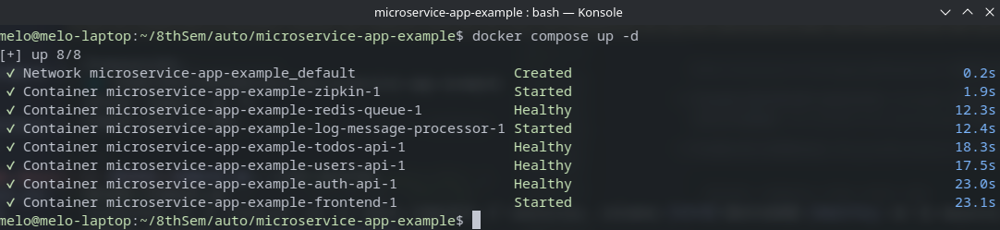
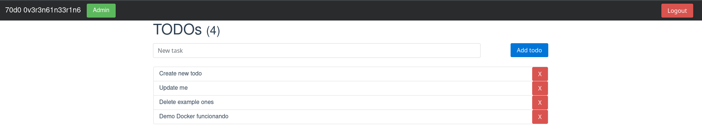
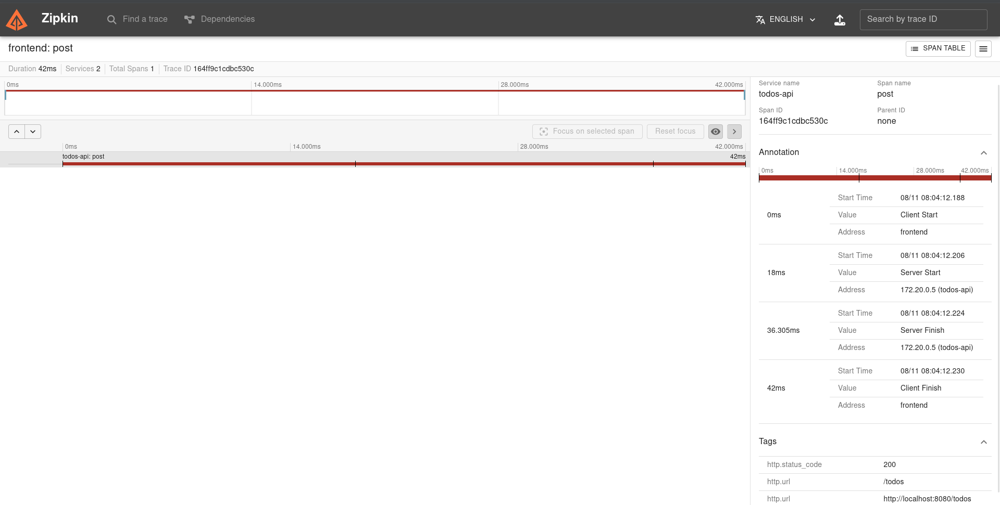
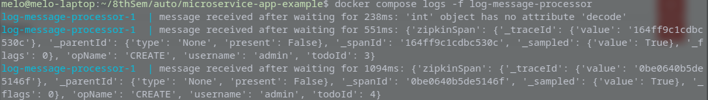

# Showcase - docker 

Capturas tomadas sobre una run de `docker compose up -d`, siguiendo el procedimiento de verificación de `docs/COMPOSE.md`. El detalle de cada decisión de diseño está en `docs/DOCKER.md` y `docs/COMPOSE.md`, este documento es solo la evidencia visual.

## 1. Todos los contenedores arriba y sanos

Salida de `docker compose up -d`: los 8 recursos (red, 5 servicios propios, Redis y Zipkin) llegan a `Healthy` o `Started` sin ningún fallo. `zipkin`, `log-message-processor` y `frontend` quedan en `Started` porque no tienen `HEALTHCHECK` bloqueante configurado del mismo modo que el resto (ver la tabla de la sección 3 de `docs/DOCKER.md`), no porque algo esté mal.

## 2. Frontend con datos reales

Login como `admin`, con un todo (`Demo Docker funcionando`) creado a través del frontend. Confirma que `frontend`, `auth-api`, `users-api` y `todos-api` están efectivamente conectados entre si a través de la red de Docker, no solo levantados por separado.

## 3. Trazado distribuido en Zipkin

Trace de la petición `POST /todos` generada al crear el todo del punto anterior. El timeline muestra las cuatro anotaciones de un span cliente/servidor completo: `Client Start` y `Client Finish` en `frontend`, `Server Start` y `Server Finish` en `todos-api`, con una duración total de 42ms. El panel de tags confirma `http.status_code: 200` y `http.url: /todos`. Esto es la prueba de que el `ZIPKIN_URL` configurado en `docker-compose.yml` para cada servicio realmente está siendo usado, no solo declarado.

## 4. Pipes and Filters en vivo

Salida de `docker compose logs -f log-message-processor` mientras se creaban todos desde el frontend. Cada creación produce un mensaje `{'opName': 'CREATE', 'username': 'admin', 'todoId': N}` que viaja de `todos-api` a `log-message-processor` a través del canal `log_channel` de Redis, sin que ninguno de los dos servicios se conozca directamente entre si. Es el pipeline Pipes and Filters descrito en la sección 5 de `docs/DOCKER.md`, corriendo de verdad.

La primera linea del log (`'int' object has no attribute 'decode'`) es el comportamiento esperado al momento de suscribirse al canal, ya documentado en `docs/DOCKER.md`, no un error introducido por la dockerización.
