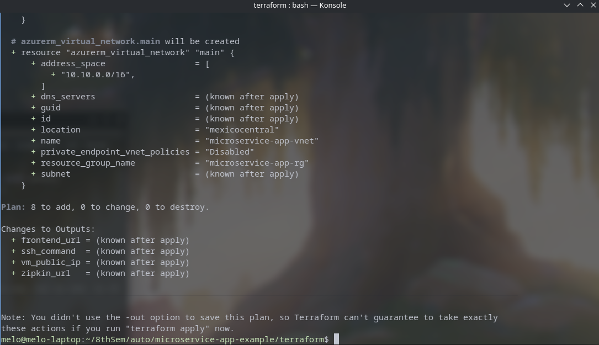
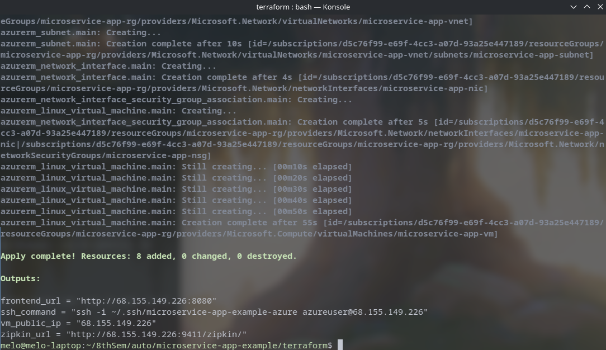
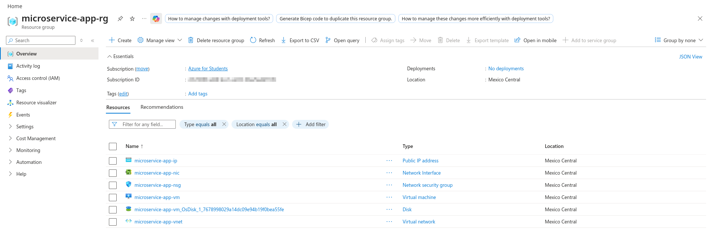
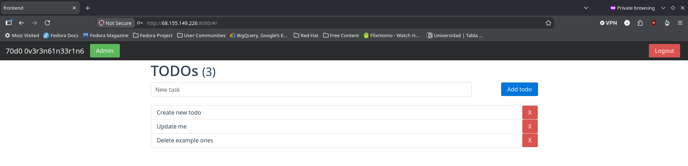

# Infraestructura en Azure con Terraform

## 1. Alcance

La carpeta terraform aprovisiona la infraestructura mínima necesaria para correr docker-compose.yml en una máquina virtual de Azure. Se crean un Resource Group, una red virtual con su subred, una IP pública, un grupo de seguridad de red y la máquina virtual, con Ubuntu 24.04 LTS. Terraform no instala Docker ni despliega la aplicación. Eso lo hace ansible, documentado en docs/ANSIBLE.md, y actúa sobre la máquina virtual que Terraform entrega.

## 2. Decisiones

La región elegida es mexicocentral. brazilsouth se descartó porque Standard_B2s no está en su catálogo de SKUs para esta suscripción. eastus se descartó porque una política de la suscripción restringe el despliegue a southcentralus, brazilsouth, westus3, eastus2 y mexicocentral. De esa lista, mexicocentral es la más cercana a Colombia y sí tiene Standard_B2s disponible. 

El tamaño de máquina virtual elegido es Standard_B2s, con dos vCPU y cuatro gigabytes de memoria. El sistema corre siete contenedores a la vez, incluida la máquina virtual de Java de users-api.

El puerto 22 queda abierto a cualquier origen, pero la autenticación por contraseña está deshabilitada en la máquina virtual, de forma que el único acceso posible es mediante la llave SSH generada específicamente para este proyecto.

Los únicos puertos públicos son el 22, el 8080 y el 9411. El primero permite que Ansible configure la máquina virtual. El segundo expone el frontend. El tercero expone Zipkin, para poder mostrar trazas distribuidas en vivo durante una demostración. Los servicios auth-api, todos-api, users-api y redis-queue no publican ningún puerto en el grupo de seguridad de red, y permanecen accesibles solo dentro de la red interna de Docker, siguiendo el mismo criterio que ya se aplicaba en el docker-compose.yml local, donde redis-queue tampoco publica puerto.

El estado de Terraform se mantiene local, en terraform/terraform.tfstate, un archivo ignorado por git.


## 3. Uso

El flujo de trabajo local sigue tres comandos.

```bash
cd terraform
terraform init
terraform plan
terraform apply
```

terraform init descarga el proveedor azurerm una sola vez. terraform plan muestra qué se va a crear. terraform apply crea los recursos.

Al finalizar el apply, terraform output entrega la IP pública, el comando de SSH ya armado y las URLs del frontend y de Zipkin.

Para destruir toda la infraestructura una vez terminado el ejercicio, y evitar seguir consumiendo crédito, se usa terraform destroy.


## 4. Evidencia









